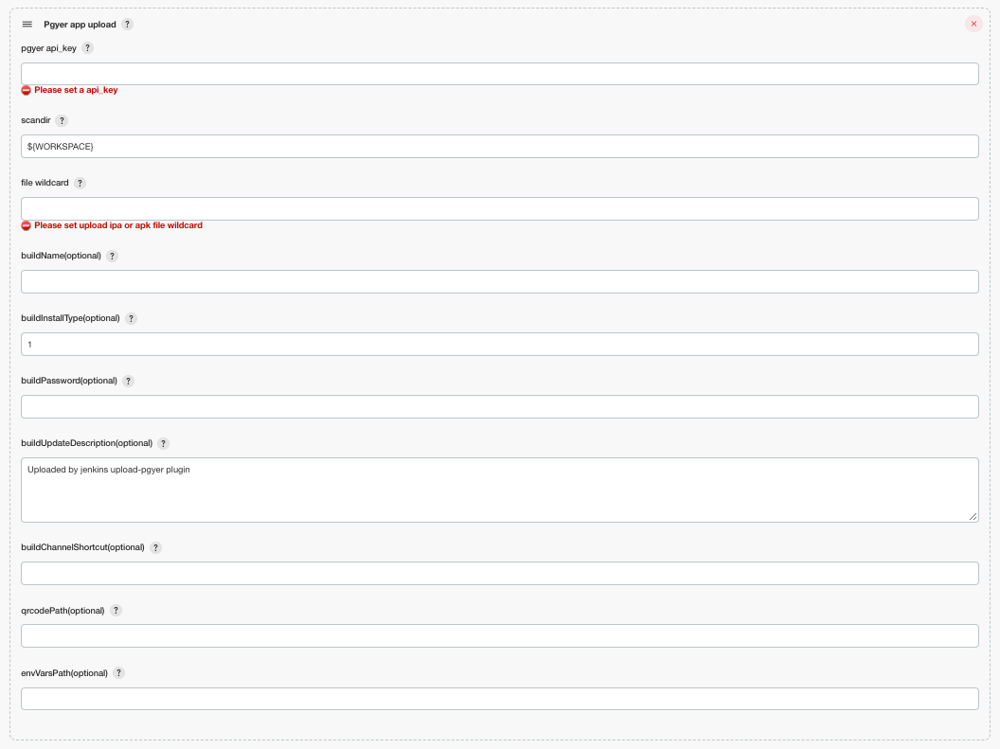
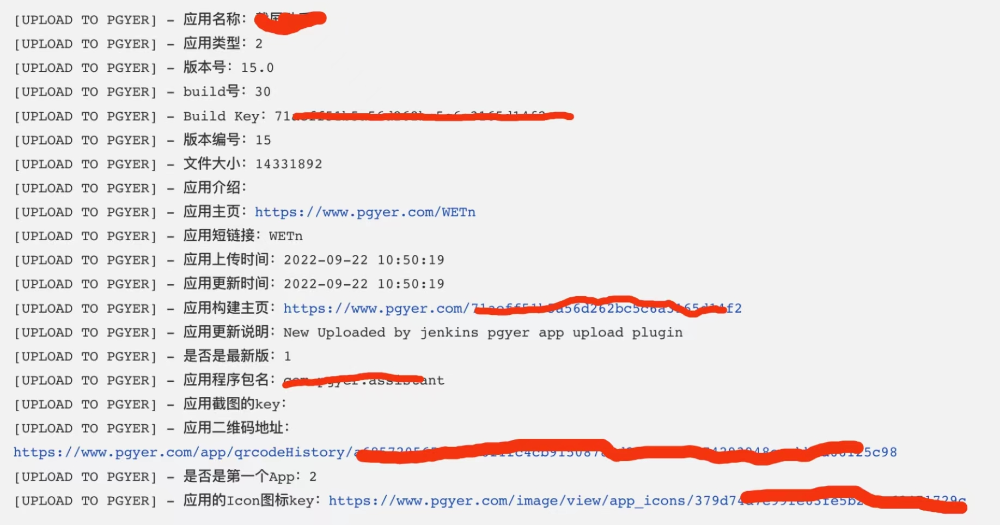

# pgyer-app-uploader

## A simple introduction

[中文文档](./README_cn.md)

Pgyer can upload the application to the site, generate installation link and qr code user to open the installation link, or scan code qr code, can start installation.

### User's guidance
So this plugin can be uploaded to the pgyer platform！**And it can put the fields returned by pgyer into an environment variable, which you can use in other build steps**, You can select `pgyer app upload` by adding build steps or adding post-build steps.

### Introduction to parameters
field|explanation
----:|:----------
api_key|`(Required)` API Key, used to identify the identity of the API caller,  if not specified, each interface needs to contain this parameter. For the same pgyer registered users, this value is fixed. [Click to get pgyer api_key](https://www.pgyer.com/account/api)
scandir|`(Required)` Need to upload ipa or apk file base dir path!   The default is ${WORKSPACE}, It means the path of the current project! It is using ant's DirectoryScanner class, [click to see DirectoryScanner class](https://ant.apache.org/manual/api/org/apache/tools/ant/DirectoryScanner.html) **It is equivalent to the parameters of the basedir method in the DirectoryScanner class!** [click to see basedir method](https://ant.apache.org/manual/api/org/apache/tools/ant/DirectoryScanner.html#basedir)
file wildcard|`(Required)` Need to upload ipa or apk file name, Support wildcards, like this: \*\*/\*.apk like this: \*\*/Test?/\*_sign.apk It is using ant's DirectoryScanner class, [click to see DirectoryScanner class](https://ant.apache.org/manual/api/org/apache/tools/ant/DirectoryScanner.html)  **It is equivalent to the parameters of the includes method in the DirectoryScanner class!** [click to see includes method](https://ant.apache.org/manual/api/org/apache/tools/ant/DirectoryScanner.html#includes)
installType|`(Optional)` Application installation, the value is (1,2,3). 1: public,  2: password installed,  3: invitation to install. The default is 1 public!
password|(Optional) Set the App installation password, if you do not want to set the password, please pass empty string, or not pass.
updateDescription|`(Optional)` Version update description, please pass empty string, or not pass.
channelShortcut|`(Optional)` The download short link of the specified channel that needs to be updated, only one channel can be specified, string type, such as: abcd.
qrcodePath|`(Optional)` If you need to download the qrcode, please enter the save path of the qrcode!otherwise, not download!
envVarsPath|`(Optional)` if you need to save info, please enter save file path! otherwise, not save!

### Running log

When it runs successfully, you can use the environment variables that are used! Return information:

### Change Log
Version 1.0(2020-08-15)
- New uploads APK/IPA files to Pgyer plug-in